# Challenge 03 - Templo Mayor

## Integrantes del equipo
- Debbimar Díaz Santiago
- Jonlier Díaz Rivera
- Jeremy Curry Romero

## Reglas del reto

---

## Proceso

### Paso 1

  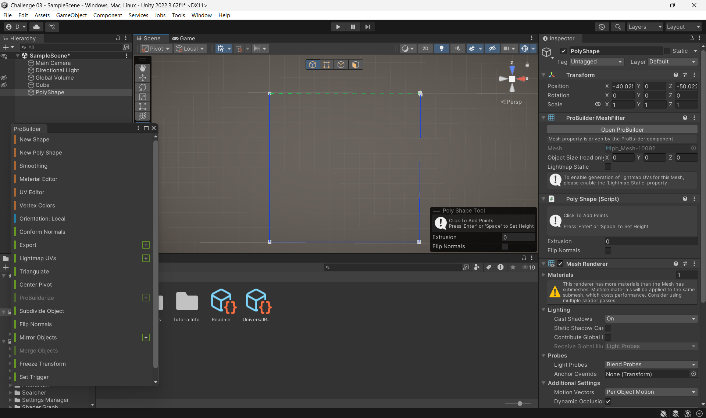
  
<i>.</i>

Para el primer paso lo primero que se hizo fue instalar ProBuilder. Para este proyecto lo principal que se utilizo fueron los Poly Shape, ya que era mas comodo para recrear las areas del templo y hacerlo mas asimetrico con el ejemplo. Primero en las opciones de ProBuilder se busco la opcion de New Poly Shape y una vez agregagado se creo la forma de un cuadrado y con un nivel de altura razonable para hacer el primer piso. 

  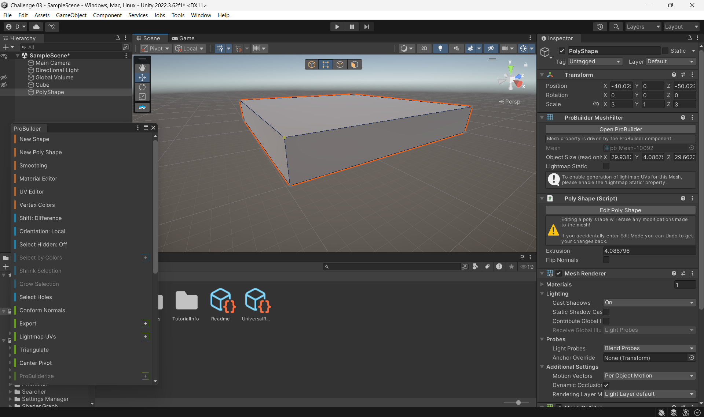
  
<i>.</i>

### Paso 2

  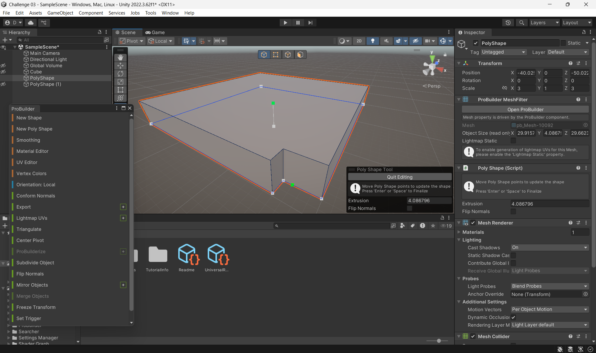
  
<i>.</i>

  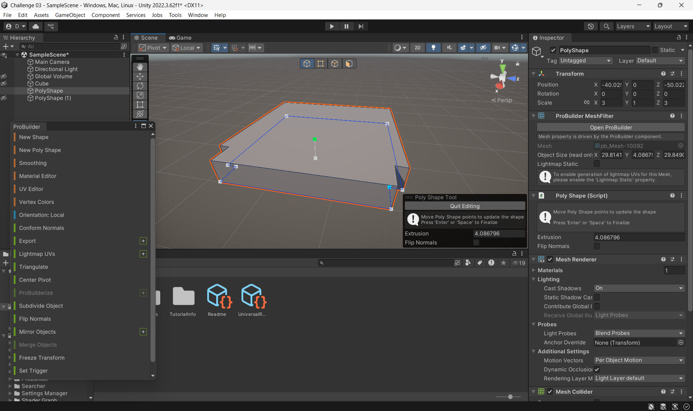
  
<i>.</i>

Aqui con la misma herramienta del Poly Shape se agregaron unos puntos en las esquinas para hundir las puntas y recrear esa esquina peculiar que tiene el frente de cada piso del templo.

### Paso 3

  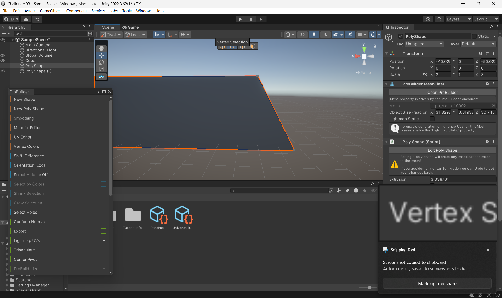
  
<i>.</i>

  
  
<i>.</i>

Con la misma herramienta del Poly Shape y los puntos de los vertices que ya estaban, se estiraron hacia atras los de la esquina de arriba para crear ese relieve en el frente del piso.

### Paso 4

Este mismo proceso se repitio para los 3 pisos restantes pero cada uno con menor tamano para recrear esa forma de piramide.

  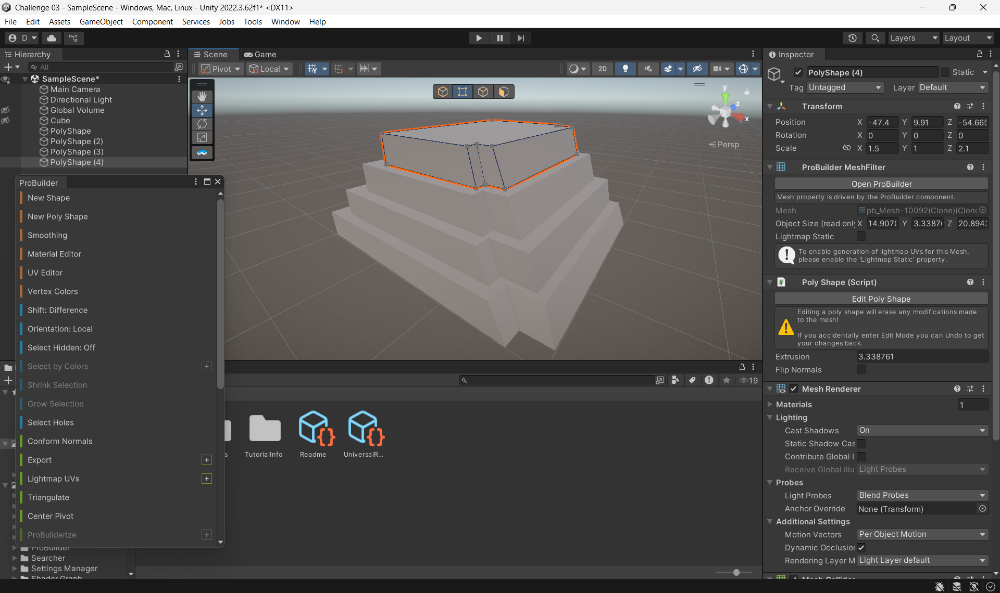
  
<i>.</i>

### Paso 5

  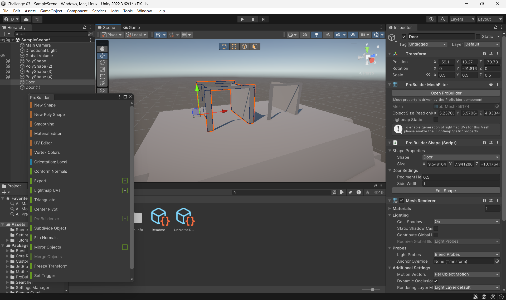
  
<i>.</i>

Luego de haber terminado los pisos con los shapes de ProBuilder nos vamos a New Shape y elegimos la opcion de Door. Como son dos casillas que hay que colocar arriba del Templo pues le dimos duplicate para tener la idea.

### Paso 6

  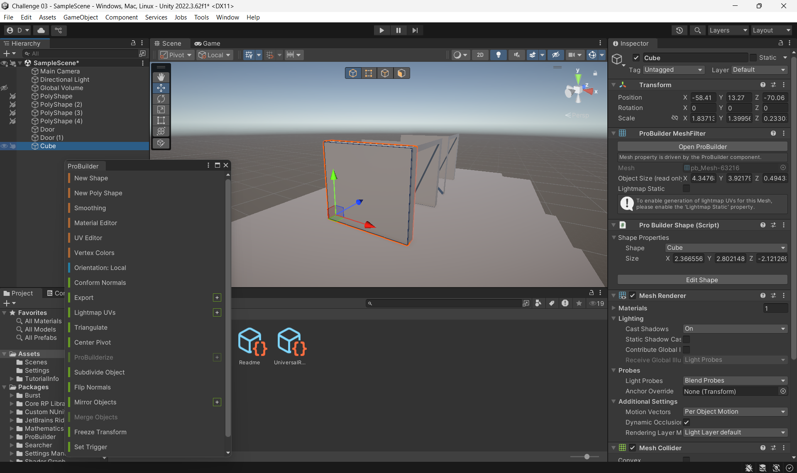
  
<i>.</i>

Despues de tener esos shapes de Door colocados en sus respectivas posiciones pues se fue a Game Object y en figuras 3D se agrego un cubo. Ese cubo con la herramienta de escala se aplano y estiro al tamano del marco y con la herramienta de mover se coloco en la esquina del marco de el objeto Door. Se duplico este objeto y se giro unos 90 grados y coloco en la otra esquina, este proceso se repitio para ambas casillas y todos los lados correspondientes excepto la del frente.

### Paso 7

  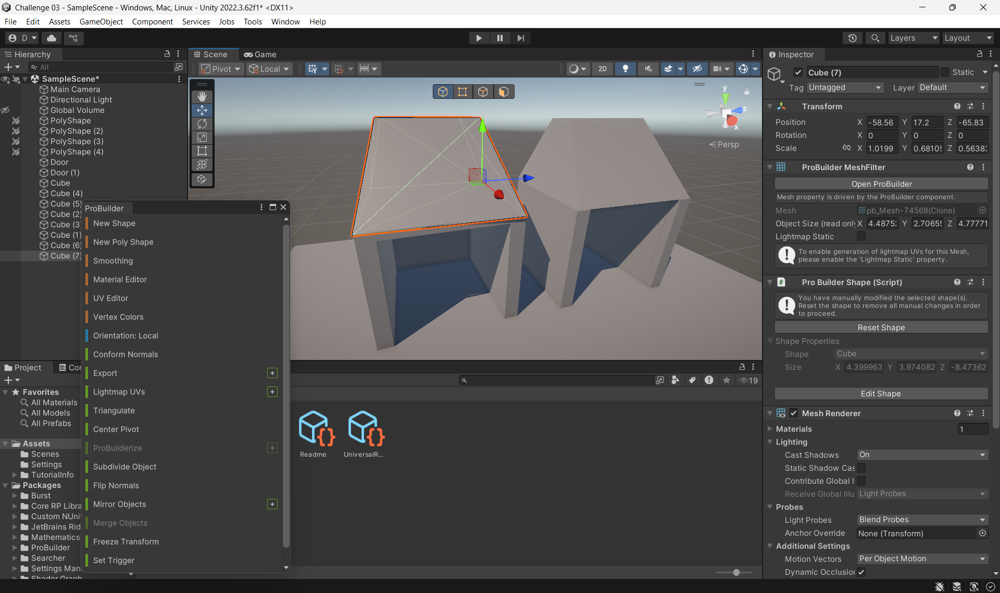
  
<i>.</i>

Se hizo un cubo y con las herramientas de los vertices y esquinas se estiro hacia arriba para hacer el efecto "techo a dos aguas" o mas o menos parecido. Por ultimo se agrego otro cubo de los objetos 3D el cual se estiro y se hizo un poco mas corto para cubrir el marco de arriba de la casilla y asi tener una entrada mas pequena. El objeto se duplica y se coloca en la otra casilla.

  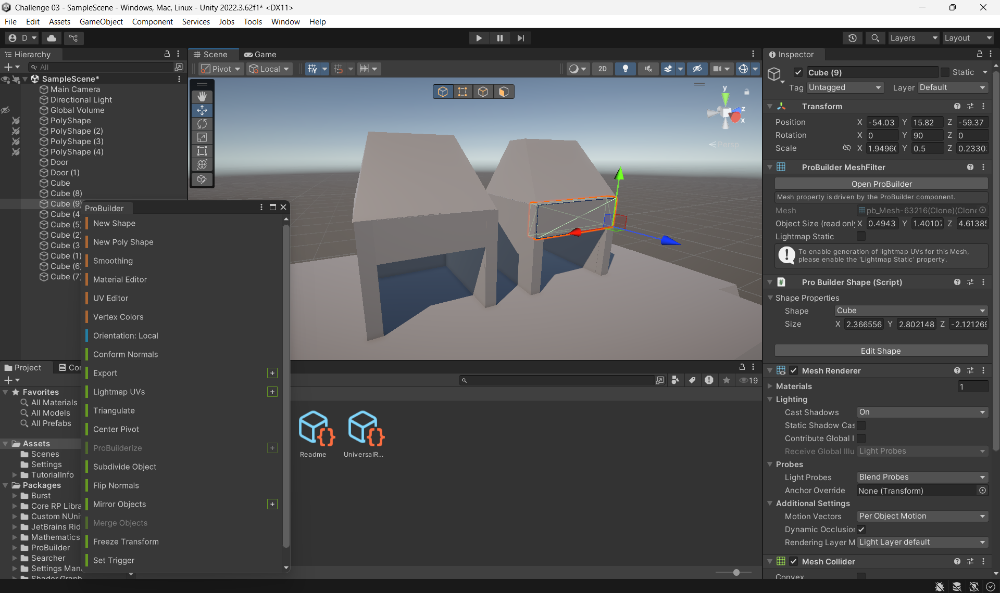
  
<i>.</i>

### Paso 8

  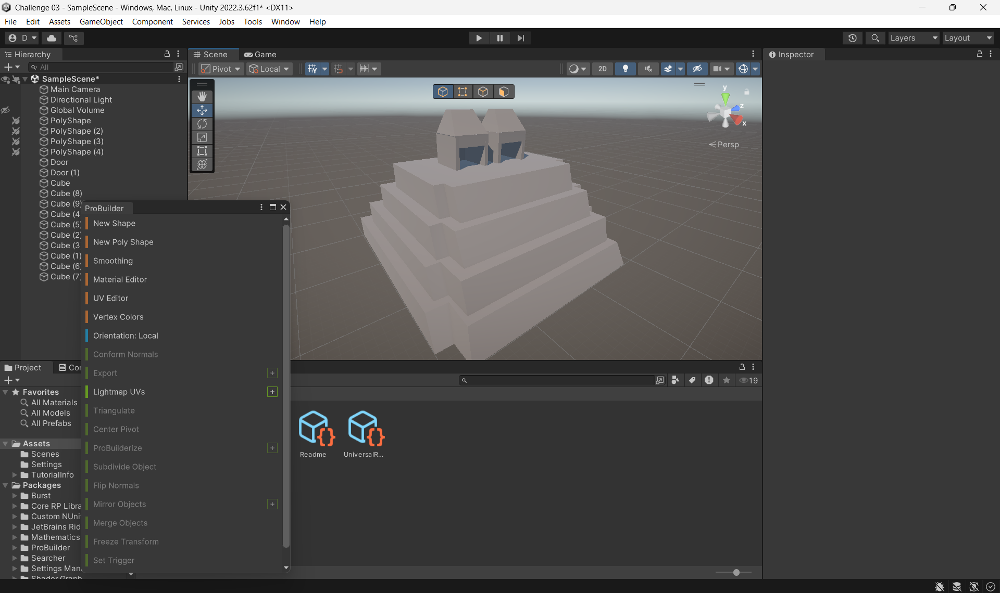
  
<i>Templo Mayor en proceso.</i>

Luego para no danar nada se puso la opcion de bloquear los objetos para precaver y no mover nada de su sitio. Con las opciones de Pro Builder se fue a New Shape y elegimos un cubo. Ese cubo se estiro mas o menos a la aultura general del templo y con la herramienta de rotar se coloco verticalmente a unos -40 grados negativos. Se coloco enfrente del templo a nivelado para recrear la escalera.

  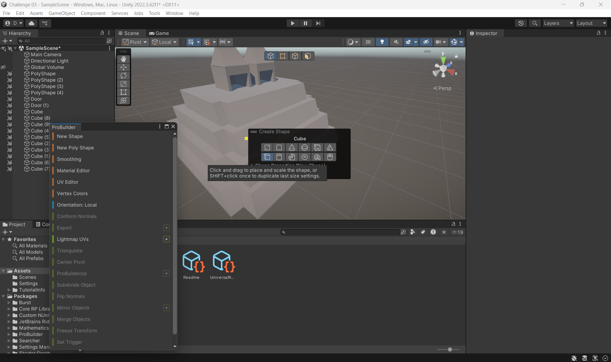
  
<i>.</i>

  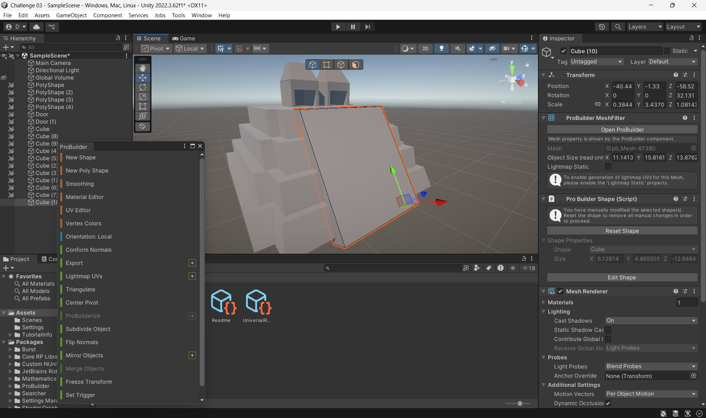
  
<i>.</i>

### Paso 9

  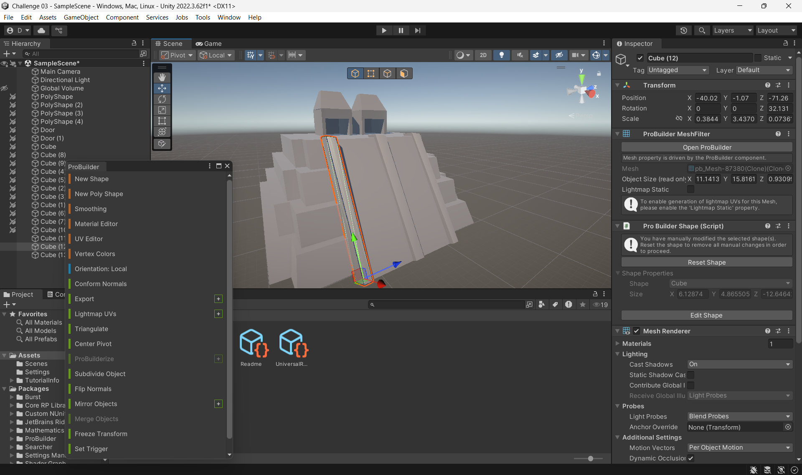
  
<i>.</i>

Luego se duplico ese mismo cubo y con la herramienta de escala se encogio el ancho para hacer los bordes, se coloco un borde y luego se duplico para la de el centro y la otra esquina.

### Paso 10

  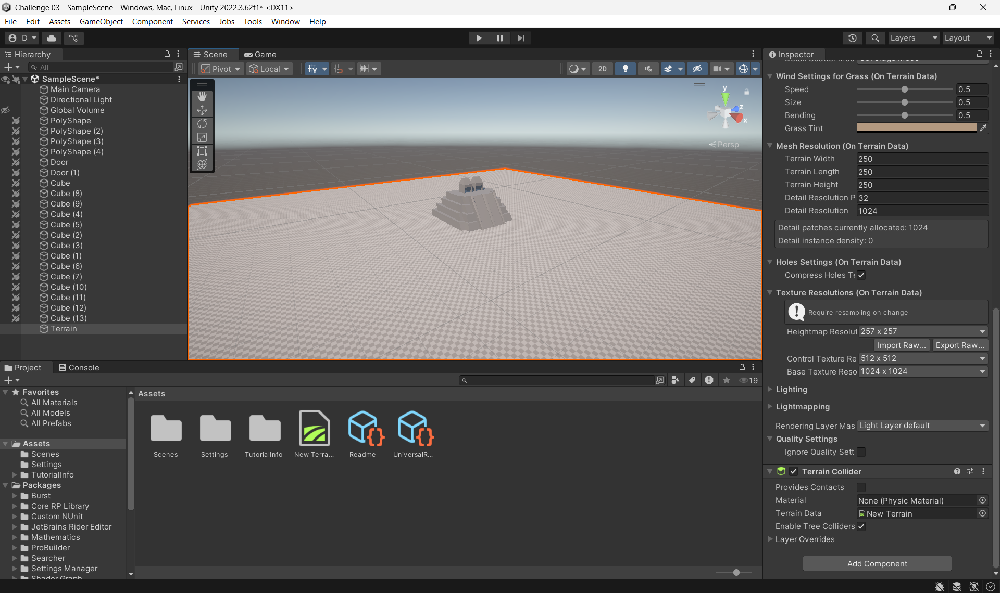
  
<i>.</i>

Una vez teniamos la mayor parte del templo hecho, se va a objetos 3D y se agrega un terreno. Al terreno se le colocan las medidas de 250 en ancho, largo y altura, tambien un hightmap resolution de 257x257. Luego en internet se busco una imagen que cumpliera con la area respectiva en donde se encontraba este templo en sus tiempos, era mas o menos tierra, fango y un poco de pasto. La imagen se importo en el area de paint texture dentro de el inspector del terreno y se creo un layer y luego de agregar esa nueva pintura se aplico.

  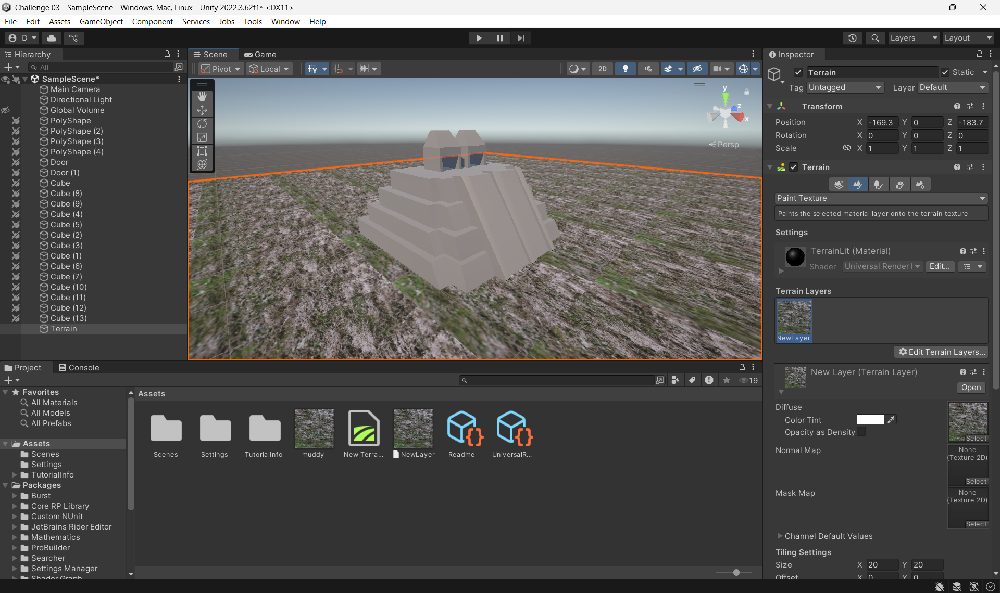
  
<i>.</i>

